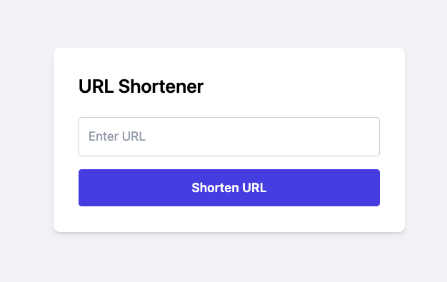
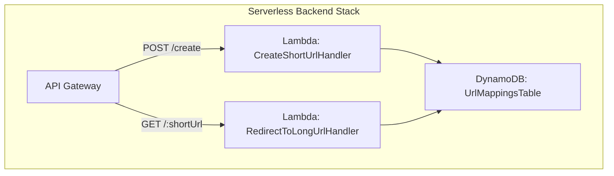

# URL Shortener

This URL Shortener application is built with the AWS Cloud Development Kit (CDK) in TypeScript. It provides a simple RESTful API to create and manage short URLs that redirect to original URLs. The [prompts](./prompt.md) which were used to generate this.



## Architecture

The application consists of two AWS Lambda functions and an Amazon DynamoDB table, exposed via an Amazon API Gateway REST API.

- Create Short URL Lambda: Processes incoming requests to create a short URL for a given original URL.
- Redirect Short URL Lambda: Processes incoming requests to redirect from a short URL to its corresponding original URL.
- Amazon DynamoDB: Stores the mapping between short URLs and original URLs.

### Backend



## Getting Started

### Prerequisites

- Install [Node.js](https://nodejs.org/en/download/)
- Install [AWS CLI](https://docs.aws.amazon.com/cli/latest/userguide/install-cliv2.html)
- Install [AWS CDK](https://docs.aws.amazon.com/cdk/latest/guide/getting_started.html)

### Deployment

1. Clone the repository:

```
git clone https://github.com/your-username/url-shortener.git
cd url-shortener
```


2. Install dependencies:

```
npm install
```


3. Bootstrap the CDK app:

```
cdk bootstrap
```

4. Deploy the URL Shortener application:

```
cdk deploy
```

The `cdk deploy` command will create and deploy the necessary AWS resources, including the Lambda functions, API Gateway, and DynamoDB table.

### Usage

You can use any REST client (e.g., Postman, curl) to interact with the deployed API.

- To create a short URL, send a POST request to the `/create` endpoint with a JSON payload containing the `originalUrl`. The API will return the short URL:

```sh
curl -X POST https://your-api-id.execute-api.your-region.amazonaws.com/prod/create \
  -H "Content-Type: application/json" \
  -d '{"originalUrl": "https://www.example.com"}'
```

To use the short URL, send a GET request to the short URL path:

```
curl -X GET -L https://your-api-id.execute-api.your-region.amazonaws.com/prod/{shortUrl}

```

The API will redirect you to the corresponding original URL. Note the -L flag is used to follow the redirect.

### Clean Up

To remove the deployed resources, run the following command:

```
cdk destroy
```
